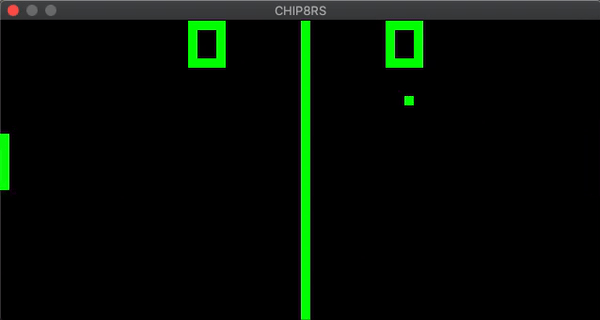

# CHIPrs / CHIPPERS

<p align="center">
  
</p>

A [CHIP-8](https://en.wikipedia.org/wiki/CHIP-8) virtual machine written in Rust. CHIP-8 is an interpreted language invented in the 1970s for programming games for 8-bit microcomputers, including classics like Pong, Space Invaders, and Tetris.

## Installation
* Install Rust using the [official installation guide](https://www.rust-lang.org/learn/get-started), which will also install the `cargo` build system.
* Clone the GitHub repository and build the emulator:

```
$ git clone https://github.com/ChrisRG/chip8rs
$ cd chip8rs
$ cargo build --release
```
The binary can then be found in `./target/release`.

## Usage

#### Emulator 
A few games have been included in the `/roms` directory. To run a ROM, use:
    
```$ ./target/release/chip8rs /roms/pong.ch8```

#### Disassembler
It is possible to disassemble a ROM into the CHIP-8 assembly language, which will create a new `.chasm` file in the same directory as the source:

```$ ./target/release/chip8rs /roms/pong.ch8 -d```

#### Assembler
To re-assemble a `.chasm` file, which will create a new file (named `<file_name>_a.ch8`) in the same directory:

```$ ./target/release/chip8rs /roms/pong.chasm -a```

## CHIP-8 Structure
The architecture for the CHIP-8 virtual machine is rather simple:

* 4096 bytes of memory (of which the first 512 bytes were normally reserved for the virtual machine)
* 16 8-bit general purpose registers for fast storage, arithmetic operations, etc.
* a program counter holding the next instruction to be decoded
* a simple stack for storing addresses during calls to sub-routines
* two timers: delay and sound (limited to a simple beep)

Once a game's ROM has been loaded (typically starting at address 0x200), the program counter increments through memory two bytes at a time, fetching the instruction or opcode at that address. The base CHIP-8 has 35 instructions (with the upgraded Super CHIP-8 adding 10 more), which include basic operations such as math, control flow, and graphics. For a list, see [this table](https://en.wikipedia.org/wiki/CHIP-8#Opcode_table) on Wikipedia. As input, the virtual machine checks for a key press from 16 possible keys. It also draws to a 64x32 pixel buffer, which has been scaled here by a factor of 10.

#### Additional resources
* [CHIP-8 Technical Reference](https://github.com/mattmikolay/chip-8/wiki/CHIP%E2%80%908-Technical-Reference)
* [CHIP-8 Instruction Set](https://github.com/mattmikolay/chip-8/wiki/CHIP%E2%80%908-Instruction-Set)
* [How to write an emulator (CHIP-8 interpreter)](http://www.multigesture.net/articles/how-to-write-an-emulator-chip-8-interpreter/) 
* [Writing a CHIP-8 emulator with Rust and WebAssembly](https://blog.scottlogic.com/2017/12/13/chip8-emulator-webassembly-rust.html)

## TODO

Short term:

- [ ] Add ability to modify CPU cycle speed
- [ ] Switch to SDL2 for video/audio/keyboard
- [ ] Redesign draw instruction to remove flickering
- [ ] Refactor assembler (it's just too ugly)

Long term:

- [ ] Implement debugger with breakpoints, stepthrough, register access
- [ ] Write a parser for a slightly higher-level language which allows for labels, variables, symbol/address lookup tables, comments, etc.
