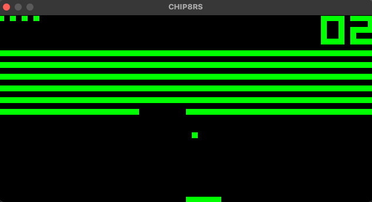

# CHIPrs / CHIPPERS

<p align="center">
  
</p>

A [CHIP-8](https://en.wikipedia.org/wiki/CHIP-8) virtual machine written in Rust. CHIP-8 is an interpreted language invented in the 1970s for programming games for 8-bit microcomputers, including classics like Pong, Breakout, Space Invaders, and Tetris.

## Contents
* [Installation](#installation)
* [Usage](#usage)
* [CHIP-8 Structure](#chip-8-structure)
* [Disassembling, re-assembling](#disassembling-and-re-assembling)
* [Additional resources](#additional-resources)
* [To do](#to-do)


## Installation
* Install Rust using the [official installation guide](https://www.rust-lang.org/learn/get-started), which will also install the `cargo` build system.
* Clone the GitHub repository and build the emulator:

```
$ git clone https://github.com/ChrisRG/chip8rs
$ cd chip8rs
$ cargo build --release
```
The binary can then be found in `./target/release`.

## Usage

#### Emulator 
A couple games have been included in the `/roms` directory. To run a ROM, use:
    
```$ ./target/release/chip8rs /roms/pong.ch8```

#### Disassembler
Using the `-d` flag, you can disassemble a ROM into the CHIP-8 assembly language, which will create a new `.chasm` file in the same directory as the source:

```$ ./target/release/chip8rs /roms/pong.ch8 -d```

#### Assembler
With the `-a` flag, you can re-assemble a `.chasm` file, creating a new file (named `<file_name>_a.ch8`) in the same directory:

```$ ./target/release/chip8rs /roms/pong.chasm -a```

**Note**: There aren't yet any checks for proper file extensions!

## CHIP-8 Structure
The architecture for the CHIP-8 virtual machine is rather simple:

* 4096 bytes of memory (of which the first 512 bytes were normally reserved for the virtual machine)
* 16 8-bit general purpose registers for fast storage, arithmetic operations, etc.
* a program counter holding the next instruction to be decoded
* a simple stack for storing addresses during calls to sub-routines
* two timers: delay and sound

Once a game's ROM has been loaded (typically starting at address 0x200), the program counter increments through memory two bytes at a time, fetching the instruction or opcode at that address. The base CHIP-8 has 35 instructions (with the upgraded Super CHIP-8 adding 10 more), which include basic operations such as math, control flow, and graphics. For a list of opcodes, see [this table](https://en.wikipedia.org/wiki/CHIP-8#Opcode_table) on Wikipedia. 

The original CHIP-8 keyboard had a 16-key keypad, which has been mapped to the following:

| 1 | 2 | 3 | 4 |
| - | - | - | - |
| Q | W | E | R |
| A | S | D | F |
| Z | X | C | V |

Each game has a different mapping, which often requires experimenting to find out the proper keys. For examples, with the `pong.ch8` ROM, the vertical movement of the left paddle can be controlled with `1` and `Q`, and that of the right paddle with `4` and `R`.

In terms of graphics, the emulator draws sprites a 64x32 pixel buffer, which has been scaled here by a factor of 10.

Audio consists of a single beep.

## Disassembling and re-assembling

<p align="center">
  
</p>

To get a better sense of the instructions used to build CHIP-8 games, I hacked together a (still pretty clunky) disassembler and assembler (see **Usage** above for running them). The disassembler will generate a `.chasm` file, which you can peruse at your leisure in your IDE of choice. 

Here is an example of the output of the disassembler for the Breakout game found in `roms/`.
<p align="center">
  
</p>

Here we see a list of instructions, written out using the [typical opcode mnemonics](http://devernay.free.fr/hacks/chip8/C8TECH10.HTM) for CHIP-8, for example:

* `LD V11, 6` => Load 6 into register `V11`
* `LD V10, 0` => Load 0 into register `V10`
* `LD I, 780` => Load the address of a sprite at memory address 780 into register `I`
* `DRW V10, V11, 1` => At position X, Y, using the numbers found in registers `V10` (0) and `V11` (6), draw a 1-byte sprite starting at memory address in register `I`

While still a bit difficult to grasp, this is significantly easier than trying to sift through the bytecode.

We can also modify these instructions and re-assemble the game. This lets us do fun things like modify the sequence of bytes used to draw to the screen, which creates glitchy and unpredictable results! For example, in `breakout.chasm` we can modify the amount of bytes to be drawn, from 1 to 12, for lines 6 (the vertical bars), 46 (the paddle), and 48 (the ball).

```
[6] DRW V10, V11, 12
...
[46] DRW V12, V13, 12
...
[48] DRW V6, V7, 12
```

Now reassemble and rerun the game:

```
$ cargo run /roms/breakout.chasm -a
$ cargo run /roms/breakout_a.ch8
```

<p align="center">
  
</p>

Now we're cooking!

<br>

## Additional resources
* [CHIP-8 Technical Reference](https://github.com/mattmikolay/chip-8/wiki/CHIP%E2%80%908-Technical-Reference)
* [CHIP-8 Instruction Set](https://github.com/mattmikolay/chip-8/wiki/CHIP%E2%80%908-Instruction-Set)
* [How to write an emulator (CHIP-8 interpreter)](http://www.multigesture.net/articles/how-to-write-an-emulator-chip-8-interpreter/) 
* [Writing a CHIP-8 emulator with Rust and WebAssembly](https://blog.scottlogic.com/2017/12/13/chip8-emulator-webassembly-rust.html)

## To do

Short term:

- [ ] Switch to SDL2 for video/audio/keyboard (in progress)
- [ ] Add ability to modify CPU cycle speed
- [ ] Redesign draw instruction to remove flickering (this one's tough)
- [ ] Refactor assembler (it's just too ugly)

Long term:

- [ ] Implement debugger with breakpoints, stepthrough, register access
- [ ] Write a parser for a slightly higher-level language which allows for labels, variables, symbol/address lookup tables, comments, etc.
